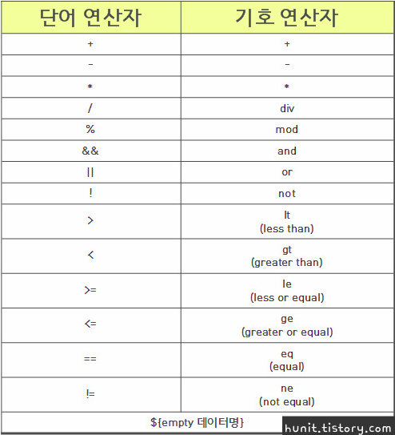
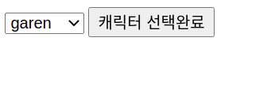
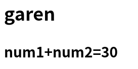
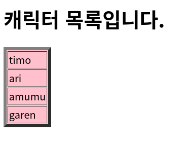

# Make the view like a 'view'

지금까지 우리는 View 화면에 스크립트릿 등을 사용하여 객체를 만들거나 동작을 수행하였다. 예를 들어 `useBean` 과 `<% %>`, `<%= %>` 를 만들어 사용했던 것처럼 말이다. 

```jsp
<% Test test = new Test(); %>
```
우리는 이와 같은 자바 코드를 대체하기 위해 아래처럼 `jsp action` 중 하나인 `useBean` 을 사용했고,
```jsp
<jsp: useBean id="test" class="test.jsp"/>
```
이 `useBean` 을 사용해 만든 객체 `test` 를 사용하기 위해 아래처럼 표현식을 사용했다. 
```jsp
<%= test.getNum() %>
```
하지만 이것은 사용하기 불편하고 코드 역시 길어질 뿐만 아니라, 결국에 자바코드를 jsp에 넣은 것이므로 이는 View에서 작업하는 퍼블리셔 혹은 웹디자이너와의 협력에서 그들의 코드 이해 속도를 떨어뜨리는 주요 원인이 될 수도 있다. 그렇기 때문에 View 는 View를 보는 주요한 사람이 이해하기 쉽도록 하기 위해 특별한 기술이 필요해진다. 그 기술에 대해 배워보도록 하자. 

## EL

EL 은 Expression Language 의 줄임말으로, 말 그대로 표현을 위한 언어이다. 이는 `<%= %>`, `out.println();` 과 같은 자바코드를 더 이상 사용하지 않고 좀 더 간편하게 출력을 지원하기 위한 도구이다. 자체적으로 아래와 같은  연산식을 지원한다. 



대표적인 EL문은 아래와 같이 사용한다. 

```jsp
${test.num} 
${test["num"]}
``` 
두 식 모두 같은 의미이다. 

만약 paramValues 를 사용하고 싶다면, 아래와 같이 사용한다. 

```jsp
${test.num[0]} 
${test["num"][1]}
```
차이점이라면 `.` 을 사용하는 경우 인덱스 0부터 시작하고 `[]` 을 사용하는 경우 인덱스 1부터 시작한다는 점이 있으나, 근본적으로 똑같은 의미를 갖는다. 

### Application

Selection 이라는 클래스를 만들어 기본 데이터를 저장해 놓자. 
```java
public class Selection {

	private String[] nameList= {"timo","ari","amumu","garen"};
	private int num1=10;
	private int num2=20;
	
	public String[] getNameList() {
		return nameList;
	}
	public int getNum1() {
		return num1;
	}
	public int getNum2() {
		return num2;
	}
}
```
그리고 이 데이터들을 받을 jsp 파일 하나를 만들어보자. 
```jsp
<jsp:useBean id="nl" class="day12.Selection" scope="session"/>
<form action="showResult.jsp" method="post">
    <select name="cname">
        <%
            for(String v:nl.getNameList()){
                out.println("<option>"+v+"</option>");
            }
        %>
    </select>
    <input type="submit" value="선택완료">
</form>
```
이제 showResult.jsp 파일을 만들어보자. 

```jsp
<h2><%=request.getParameter("cname")%><h2>
```
원래같으면 이렇게 표현식을 이용해 출력했겠지만 이제 우리는 다음과 같이 EL문을 사용할 수 있다. 
```jsp
<h2>${param.cname}<h2>
```
`param.~`을 사용하는 이유는 간단하다. 이 EL식이 어떤 자바코드를 대체하였는지 알면 된다. 우리가 `request.getParameter();` 을 사용하였기 때문에 파라미터값을 받는 것이므로 `param.~`을 사용하는 것이다. 

또한 Selection 클래스의 num1과 num2를 서로 연산해보는 코드를 아래와 같이 만들 수 있다. 
```jsp
<h3>num1+num2=${nl.num1+nl.num2}</h3>
```
그렇게 완성된 showResult.jsp 는 다음과 같다.
```jsp
<h2>${param.cname}</h2>
<h3>num1+num2=${nl.num1+nl.num2}</h3>
```

이들을 실행하면 다음과 같은 결과가 나오게 된다. 




## CustomTag

커스텀 태그는 화면의 코드를 단순하게 변경할 수 있다. 즉, 로직적인 부분을 VIEW에서 숨길 수 있기 때문에, 캡슐화의 역할을 하며 보다 MVC패턴에 가까워진다. 

커스텀태그를 만드는 방법은 두가지가 있다. 

1. 태그 파일기반 (.tag)
	- .tag 파일을 만들어 사용한다. 
	- 비교적 구현이 간단하다. 
2. 태그 핸들러클래스 기반 (.java)
	- 배포가 용이하다 
	- 구현이 비교적 어렵다. 

### 1. tag file 

태그는 왜 사용할까? 로직적으로 반복되는 코드가 있을 때, 외부 파일로 한번에 관리하는 데 유용하다. 또한 위에서 언급했듯이 로직 파트가 VIEW에 보이지 않기 때문에, VIEW의 본질에 더 가까워지게 된다. 

태그 파일 기반으로 커스텀 태그를 사용하려면, 아래와 같은 생각의 흐름이 필요하다. 

1. tag 파일을 만든다. 이때, **tag파일은 반드시 `WEB-INF` 아래 tag 폴더 안에 위치해야 한다.**
```jsp
<%@ tag language="java" pageEncoding="UTF-8"%>
태그파일! 
```

2. 커스텀태그를 사용할 .jsp 파일을 만든다. 이때 태그 파일이 있다는 것을 알려주기 위해 `<%@ taglib prefix="mytag" tagdir="/WEB-INF/tags" %>` 코드를 반드시 넣어야 한다. prefix에 할당하는 값은 `<mytag:show ... />` 처럼 태그이름으로 사용할 때 사용되며, tagfir은 태그파일의 위치를 상대경로로 넣어주면 된다. 
```jsp
<%@ page language="java" contentType="text/html; charset=UTF-8"
    pageEncoding="UTF-8"%>
<%@ taglib prefix="mytag" tagdir="/WEB-INF/tags" %>
<!DOCTYPE html>
<html>
<head>
<meta charset="UTF-8">
<title>태그 파일기반 실습</title>
</head>
<body>

<h1><mytag:show/></h1>

</body>
</html>
```

이 jsp 파일을 실행시키면 아래와 같은 결과가 나온다. 


***

이제 조금 더 태그를 응용해보자. 아래 코드처럼 VIEW 내에 스크립트릿이 있는 경우 VIEW를 읽기 힘들어지므로, `<% ... %>` 부분에 해당하는 곳을 태그로 옮겨서 VIEW를 VIEW 답게 만들어보자. 
```jsp
<body>
<jsp:useBean id="nl" class="day12.Selection" scope="session" />
<form action="showResult.jsp" method="post">
	<select name="cname">
		<%
			for(String v:nl.getNameList()){
				out.println("<option>"+v+"</option>");
			}
		%>
		--> 이 부분을 tag 파일로 옮겨보자! 

	</select>
	<input type="submit" value="캐릭터 선택완료">
</form>
</body>
```

태그를 사용하려면 위에서 언급한대로 **태그 파일을 만들고, taglib 지시어를 jsp 파일에 넣어주어야 한다.** 

나는 `showList.jsp` 파일을 변형시켜서 `showList2.jsp` 로 만들 계획이고, 참조하는 태그파일은 `selection.tag` 이다. 

1. 먼저 `selection.tag` 를 만들어보자. 커스텀태그 역시 어쨌든 하나의 태그이기 때문에, 태그 내에 속성을 부여할 수 있다. 태그 파일에서는 `<%@ attribute name="border" %>` 와 같이 속성을 받아올 수 있다. 

```jsp
<%@ tag language="java" pageEncoding="UTF-8"%>

<%@ attribute name="border" %>
<%@ attribute name="bgcolor" %>

<jsp:useBean id="sel" class="day12.Selection" />

<h1><jsp:doBody /></h1>
--> jsp에서 커스텀태그의 태그바디에 해당하는 부분을 받아와서 h1 으로 출력한다. 

<table border="${border}" bgcolor="${bgcolor}">
	<%
		for(String v:sel.getNameList()){
			out.println("<tr><td>"+v+"</tr></td>");
		}
	%>
</table>
```

2. 이제 만든 태그파일을 사용하는 jsp파일을 만들어보자. 원래는 jsp body 내부에 많은 코드들이 있었지만, 커스텀태그를 사용해 로직적인 부분을 숨기고 VIEW에 해당하는 부분만 노출시켰다.

```jsp
<%@ page language="java" contentType="text/html; charset=UTF-8"
    pageEncoding="UTF-8"%>
<%@ taglib prefix="mytag" tagdir="/WEB-INF/tags" %>
<!DOCTYPE html>
<html>
<head>
<meta charset="UTF-8">
<title>Insert title here</title>
</head>
<body>

<mytag:selection border="5" bgcolor="pink">캐릭터 목록입니다.</mytag:selection>
--> 태그바디에 해당하는 내용이 태그에 의해 h1 으로 출력될 것이다. 

</body>
</html>
```

이제 jsp파일을 실행시키면 아래와 같은 결과가 나온다. 



### 2. TagHandler  

태그 핸들러를 사용하기 위해서는 먼저 .java 파일을 만들어야 한다. src 폴더 내에 `MsgHandler.java` 파일을 만들어준다. 이때 ~Support 라고 끝나는 클래스를 extends 해주게 되는데, 그냥 간단하게 핸들러클래스의 틀을 잡아주었다고 생각하면 편하다. 또한, JspWriter의 IOException을 처리하기 위해 try catch 문을 사용할 수도 있지만, throws를 통해 예외처리를 상위메서드로 미뤘다. 

```java
package src;

import java.io.IOException;

import javax.servlet.jsp.JspWriter;
import javax.servlet.jsp.tagext.SimpleTagSupport;

public class MsgHandler extends SimpleTagSupport {

	public void doTag() throws IOException {
		JspWriter out=getJspContext().getOut();
		out.println("태그 핸들러클래스기반 출력결과!");
	}
}
```

이제 이렇게 만든 핸들러클래스를 어떻게 쓸지 알려주는 커스텀태그 정의파일이 필요하다. 그 정의파일을 모아놓은 폴더 이름은 `tld` 이고, 파일 확장자는 .xml이다. 참고로, xml파일은 설정파일을 의미한다. 

`tld`는 **Tag Library Descriptor** 의 줄임말이며, `xml`은 **eXtensible Markup Language** 의 줄임말이다. 이에 관련한 자세한 설명은 아래 블로그를 참조하자.  
[What is TLD?](https://dololak.tistory.com/750)

이렇게 tld파일을 만들기 위해 `<tag>` 로 태그를 설명할 공간을 만들어준다. 먼저 `<name>` 에서 jsp파일에서 사용할 태그 이름을 설정하고, `<tag-class>`에서 태그를 가져올 클래스를 정의해주고, `<body-content>` 에서 태그바디에 무엇을 넣을것인지 설명해주면 된다. 만약 아무것도 넣지 않을 것이라면 `empty`를 넣으면 되고, JSP 코드를 넣을 것이라면 `JSP`를 넣으면 된다. 

```xml
<?xml version="1.0" encoding="UTF-8"?>
<taglib version="2.0" xmlns="http://java.sun.com/xml/ns/j2ee" xmlns:xml="http://www.w3.org/XML/1998/namespace" xmlns:xsi="http://www.w3.org/2001/XMLSchema-instance" xsi:schemaLocation="http://java.sun.com/xml/ns/j2ee http://java.sun.com/xml/ns/j2ee/web-jsptaglibrary_2_0.xsd ">
  <tlib-version>0.0</tlib-version>
  <short-name>NMTOKEN</short-name>
  
  <tag>
  	<name>print</name>
  	<tag-class>day12.MsgHandler</tag-class>
  	<body-content>empty</body-content>
  </tag>

</taglib>
```

이렇게 태그를 가져올 수 있게 되었으니, jsp 파일을 만들어보자. 이때, 맨 위에 `taglib` 를 정의해주어야 한다. uri를 통해 tld파일의 위치를 지정해주면 된다. 또한 태그바디를 empty로 설정하였으므로 `<mytag:print/>` 만 사용하면 된다. 
```jsp
<%@ page language="java" contentType="text/html; charset=UTF-8"
    pageEncoding="UTF-8"%>
<%@ taglib prefix="mytag" uri="/WEB-INF/tld/MsgHandler.tld" %>
<!DOCTYPE html>
<html>
<head>
<meta charset="UTF-8">
<title>태그 핸들러클래스기반 실습</title>
</head>
<body>

<h1><mytag:print/></h1>

</body>
</html>
```

이 jsp 파일을 실행시키면 아래와 같은 결과가 나오게 된다.
