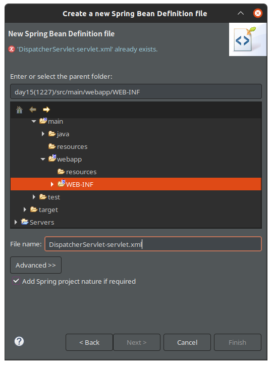

# Spring 

이제 우리가 지금까지 사용해왔던 DisaptcherServlet.java 파일과 EncFilter.java 파일과 같은 MVC의 핵심 부분을 스프링 프레임워크에서 기본제공하는 것들로 변경해볼 것이다. 

## web.xml

```xml
<?xml version="1.0" encoding="UTF-8"?>
<web-app xmlns:xsi="http://www.w3.org/2001/XMLSchema-instance" xmlns="http://java.sun.com/xml/ns/javaee" xsi:schemaLocation="http://java.sun.com/xml/ns/javaee https://java.sun.com/xml/ns/javaee/web-app_2_5.xsd" version="2.5">
  <servlet>
    <description></description>
    <display-name>DispatcherServlet</display-name>
    <servlet-name>DispatcherServlet</servlet-name>
    <!-- <servlet-class>com.test.app.controller.DispatcherServlet</servlet-class> -->
    <servlet-class>org.springframework.web.servlet.DispatcherServlet</servlet-class>
    <!-- 스프링 프레임워크에서 기본제공하는 클래스로 변경 -->
  </servlet>
  
  <servlet-mapping>
    <servlet-name>DispatcherServlet</servlet-name>
    <url-pattern>*.do</url-pattern>
  </servlet-mapping>
  
  <filter>
    <display-name>EncodingFilter</display-name>
    <filter-name>EncodingFilter</filter-name>
    
   <!--  <filter-class>com.test.app.controller.EncodingFilter</filter-class> -->
   
 	<filter-class>org.springframework.web.filter.CharacterEncodingFilter</filter-class>
 	<init-param>
 		<param-name>encoding</param-name>
 		<param-value>UTF-8</param-value>
 	</init-param>
  </filter>
 
  <filter-mapping>
    <filter-name>EncodingFilter</filter-name>
    <url-pattern>*.do</url-pattern>
  </filter-mapping>
  <filter-mapping>
    <filter-name>EncodingFilter</filter-name>
    <url-pattern>*.jsp</url-pattern>
  </filter-mapping>
</web-app>
```

이대로 만들고 실행시키면, `/WEB-INF/DispatcherServlet-servlet.xml`이 없다는 문제가 발생한다. 따라서 이것을 만들어주자. 

## DispatcherServlet-servlet.xml 

기존의 서블릿파일은 삭제해준다. 
참고로, xml파일의 이름은 web.xml에서 설정한 이름대로 설정해주어야 한다. 



## Delete Controller Interface

스프링 프레임워크를 사용하기 위해, 기존 컨트롤러 인터페이스를 삭제시킨다. 그리고 ~~Controller.java 으로 가면 인터페이스가 사라졌으니 오류가 발생한다. 그러나 여기서 Ctrl+Shift+O 를 눌러주면 `import org.springframework.web.servlet.mvc.Controller;` 이 import된다. 또한, 메서드의 반환타입 역시 String에서 `public ModelAndView handleRequest(HttpServletRequest request, HttpServletResponse response) ` 처럼 ModelAndView 타입으로 바뀌게 된다. 


## Update ~~Controller.java Files

예시로 LoginController을 변경해보았다. 

```java
package com.test.app.member;

import javax.servlet.http.HttpServletRequest;
import javax.servlet.http.HttpServletResponse;

import org.springframework.web.servlet.ModelAndView;
import org.springframework.web.servlet.mvc.Controller;

import com.test.app.member.impl.MemberDAO;

public class LoginController implements Controller{

	@Override
	public ModelAndView handleRequest(HttpServletRequest request, HttpServletResponse response) {
		MemberVO vo=new MemberVO();
		vo.setMid(request.getParameter("mid"));
		vo.setPassword(request.getParameter("password"));
		MemberDAO dao=new MemberDAO();
		MemberVO data=dao.selectOne(vo);
		
		ModelAndView mav = new ModelAndView();	
		if(data!=null) {
            mav.addObject("member", data);
			mav.setViewName("main.do");	
			/*return "main.do";*/
		}
		else {
			mav.setViewName("login.jsp");
			/*return "login";*/
		}
		return mav;
	}
}
```

spring_1228과 이어집니다. 