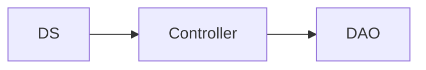
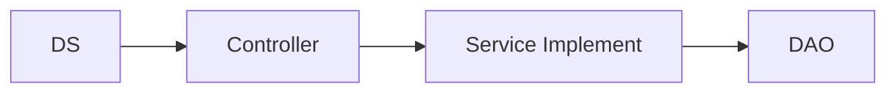

# 2-Layerd 아키텍쳐 

1. 클라이언트가 요청 
2. *.do 요청일 경우 
3. DispatcherServlet 가 작동하여 요청을 인식
4. Controller에게 해당하는 요청을 처리하라고 하며 전달 

jsp에서는 ~~Action을 통해 만들었지만, Spring에서는 Controller로 처리한다. 이때, 처음에는 우리가 자체적으로 인터페이스로 만든 Controller로 쓰다가, Spring.MVC에서 제공하는 Controller을 사용하고, 이제 @RequestMapping 을 통해서 모든 요청을 하나의 Controller 클래스로 통합시킬 수 있다. 

Controller는 사용자의 요청정보를 추출하고, DAO객체를 사용해 요청한 서비스를 처리한다. 처음에는 request 객체로 하나하나 데이터들을 받아서 set 해주었다면, 이제는 매개변수로 Command객체(VO, DAO 같은 스타일의 객체들)를 넘기는 순간 자동으로 컨테이너가 set 해준다. 

이때 매개변수로 넘기는 Command객체에서 DAO객체를 직접 사용하게 되면, 만일 DAO 이름이 변경되었을 경우에 유지보수가 불리해진다. 따라서, [비즈니스 컴포넌트] 를 사용한다. 

```java
@RequestMapping("/board.do")
	public String board(BoardVO vo,BoardDAO dao,Model model) {
	
		model.addAttribute("data", dao.selectOne(vo));
		return "board.jsp";
	}
	@RequestMapping(value="/insertBoard.do")
	public String insertBoard(BoardVO vo,BoardDAO dao) {
		
		dao.insertBoard(vo);
		return "main.do";
	}
```
*이런 코드가 있었다고 치면, DAO가 변경될 경우 매개변수 하나하나를 변경해주어야 한다.. ㅠㅠ*

컴포넌트는 위젯 같은걸 생각하면 편하다. 시계 위젯을 생각해보자. 어느 페이지든 간에 그 위젯의 코드만 가져오면  개별적으로 작동하기 때문에 혼자서든 같이서든 잘 작동된다. 이런것들을 컴포넌트라고 한다.

그래서 Controller가 요청을 처리할 때 비즈니스 컴포넌트를 사용하게 할 것이다. 이렇게 하면, DAO클래스 변경을 더 빠르고 간단하게 할 수 있게 된다. 비즈니스 객체를 사용해 DAO를 호출해 사용할 수 있게 된다. 또한, **AOP지원이 가능**해진다. 

## Service Implement  

- 목적 

    비즈니스 컴포넌트(이하 BC)의 입장에서 보면, 자신을 사용하는 클래스가 Controller(이하 C)이다. 따라서 C가 BC를 이용하기 위해서는 BC를 내부에서 new 해줘야 하는데, new를 해줘도 되지만 우리는 @Autowired을 통해 객체를 생성해준다. BC 클래스 이름을 BoardServiceImpl(이하 BSI)라고 하면 우리가 BSI객체를 만든 것이므로, 그 BSI를 통해 DAO를 부를 수 있게 된다. 따라서, 최종적으로는 DAO를 변경(BoardDAO를 BoardDAO2로 변경하는 것)해도 C 코드에 변화가 없으면 된다. 

> 기존코드 

```java
package com.test.app.board;

import java.util.HashMap;
import java.util.Map;

import org.springframework.beans.factory.annotation.Autowired;
import org.springframework.stereotype.Controller;
import org.springframework.ui.Model;
import org.springframework.web.bind.annotation.ModelAttribute;
import org.springframework.web.bind.annotation.RequestMapping;
import org.springframework.web.bind.annotation.SessionAttributes;

import com.test.app.board.impl.BoardDAO;
import com.test.app.board.impl.BoardServiceImpl;

@Controller
@SessionAttributes("data") 
// /board.do RM을 통해 전달받은 data 을 저장하고 있다가, 필요하면 MA로 불러서 데이터를 보내준다. 
public class BoardController {

	// @RequestMapping보다 먼저 호출되는 @MA
	   @ModelAttribute("conditionMap")
	   public Map<String,String> searchConditionMap(){
	      Map<String,String> conditionMap = new HashMap<String,String>();
	      conditionMap.put("제목", "title");
	      conditionMap.put("작성자", "writer");
	      return conditionMap;
	   }
	@RequestMapping("/board.do")
	public String board(BoardVO vo,BoardDAO dao,Model model) {
	
		model.addAttribute("data", dao.selectOne(vo));
		return "board.jsp";
	}
	@RequestMapping(value="/insertBoard.do")
	public String insertBoard(BoardVO vo,BoardDAO dao) {
		
		dao.insertBoard(vo);
		return "main.do";
	}
	@RequestMapping("/main.do")
	public String main(BoardVO vo,BoardDAO dao,Model model) {
		// 이 model 에는 현재 Map과 ArrayList 두가지 컬렉션이 들어있다. 
		model.addAttribute("datas",dao.selectAll(vo));
		return "main.jsp";
	}
	@RequestMapping(value="/updateBoard.do", produces="text/plain;charset=UTF-8")
	public String updateBoard(@ModelAttribute("data")BoardVO vo,BoardDAO dao) {
		// MA를 통해서 SA가 갖고있는 값을 불러올 수 있고, null update 방지 처리를 해준다. 
		dao.updateBoard(vo);
		return "main.do";
	}
	@RequestMapping("/deleteBoard.do")
	public String deleteBoard(BoardVO vo,BoardDAO dao) {
	
		dao.deleteBoard(vo);
		return "main.do";
	}
}
```

> 변경코드 

```java
package com.test.app.board;

import java.util.HashMap;
import java.util.Map;

import org.springframework.beans.factory.annotation.Autowired;
import org.springframework.stereotype.Controller;
import org.springframework.ui.Model;
import org.springframework.web.bind.annotation.ModelAttribute;
import org.springframework.web.bind.annotation.RequestMapping;
import org.springframework.web.bind.annotation.SessionAttributes;

import com.test.app.board.impl.BoardDAO;
import com.test.app.board.impl.BoardServiceImpl;

@Controller
@SessionAttributes("data") 
// /board.do RM을 통해 전달받은 data 을 저장하고 있다가, 필요하면 MA로 불러서 데이터를 보내준다. 
public class BoardController {
	
	@Autowired
	BoardService bs;
	
	// @RequestMapping보다 먼저 호출되는 @MA
	   @ModelAttribute("conditionMap")
	   public Map<String,String> searchConditionMap(){
	      Map<String,String> conditionMap = new HashMap<String,String>();
	      conditionMap.put("제목", "title");
	      conditionMap.put("작성자", "writer");
	      return conditionMap;
	   }
	@RequestMapping("/board.do")
	public String board(BoardVO vo, Model model) {
	
		model.addAttribute("data", bs.selectOne(vo));
		return "board.jsp";
	}
	@RequestMapping(value="/insertBoard.do")
	public String insertBoard(BoardVO vo) {
		
		bs.insertBoard(vo);
		return "main.do";
	}
	@RequestMapping("/main.do")
	public String main(BoardVO vo,Model model) {
		// 이 model 에는 현재 Map과 ArrayList 두가지 컬렉션이 들어있다. 
		model.addAttribute("datas",bs.selectAll(vo));
		return "main.jsp";
	}
	@RequestMapping(value="/updateBoard.do", produces="text/plain;charset=UTF-8")
	public String updateBoard(@ModelAttribute("data")BoardVO vo) {
		// MA를 통해서 SA가 갖고있는 값을 불러올 수 있고, null update 방지 처리를 해준다. 
		bs.updateBoard(vo);
		return "main.do";
	}
	@RequestMapping("/deleteBoard.do")
	public String deleteBoard(BoardVO vo) {
	
		bs.deleteBoard(vo);
		return "main.do";
	}
}
```

이렇게 만들면 다음과 같은 로직으로 변경된다. 

- 변경 전 


- 변경 후

여기서 Controller 까지를 Presentation Layer 이라고 하고, SI부터 DAO까지 Business Layer 이라고 한다. 

## 문제? 

근데 이때 문제가 두가지 발생한다. 

1. DI 실패 
2. applicationContent.xml 감지 불가 

DI가 실패한 이유는, Service객체가 존재해야 Autowired 가 가능해지는데, BS가 없기 때문이다. 

원인해설: BS객체가 원래(이미) 존재해야 @Autowired가 가능함!!!
         해결하려면? BS객체를 C를 생성하기 이전에 먼저 new해야함!!!!!
         => 스프링컨테이너를 먼저 동작시키고, 서블릿컨테이너가 동작하는 형태(DS->C->BS)
   객체주입시 BoardService타입의 객체가 발견되지않는 문제
   DI @Autowired   BSImpl
   => 객체주입의 대상이 되는 객체가 메모리에 적재되어있어야한다!
          BSImpl      <bean>(.xml) @ == 스프링컨테이너 구동순서에 변화를 주자!
※ 클라이언트 요청-> DS생성 : DS-servlet.xml -> 스프링컨테이너가 동작 : applicationContext.xml
   ??? C보다 비즈니스 컴포넌트(==BSI)를 먼저 생성하려면,
   BSI를위한 또다른 컨테이너를 생성해보자!

이것을 2-Layered 아키텍쳐라고 한다. 

ContextLoaderListener는 서블릿컨테이너의 구동을 감지해서, 스프링컨테이너를 하나 추가한다. 

applicationContext.xml을 참조함
x) applicationContext.xml 위치변경 : 원래의 스프링컨테이너에서 문제발생
x) applicationContext.xml 복사하여 추가 : 유지보수 불리
o) WEB/INF 보고있는데... resources 참조해볼래? -> 설정변경

설정변경? 바로 web.xml에 추가해준다. 

```xml
<context-param>
    <param-name>contextConfigLocation</param-name>
    <param-value>classpath:applicationContext.xml</param-value>
</context-param>
<listener>
    <listener-class>org.springframework.web.context.ContextLoaderListener</listener-class>
</listener>
``` 

## + 오류해결 
mypage.jsp에서 name값을 한글로 넘겨주었을 때에만 글자가 깨지는 현상이 발생했다. 의외인 점은 같은 update 구문을 실행하는 board_update에서는 한글값이 잘 넘어갔다는 것이다. 따라서 전체적인 인코딩 문제는 아니고, mypage.jsp 에서 값을 Model로 넘길 때 인코딩이 잘못된 것 같았다. 그래서 아래와 같이 수정하여 해결하였다. 

```jsp
<form action="mypage.do" method="post" accept-charset="UTF-8">
```

## ++ 오류해결 2 

위의 문제를 해결하고 의문이 남아서 코드를 살펴봤는데, 그냥 charset="EUC-KR"이 문제였다... UTF-8로 바꿔주자. 역시 문제는 멀리있지 않다 ㅠㅠ 