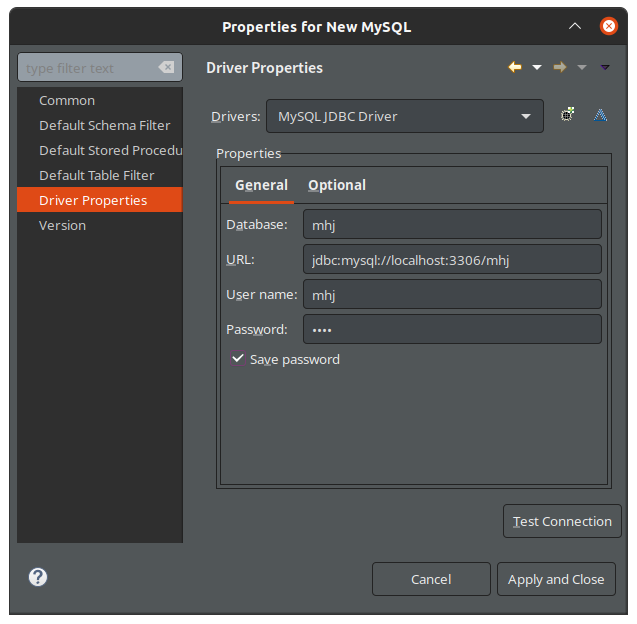
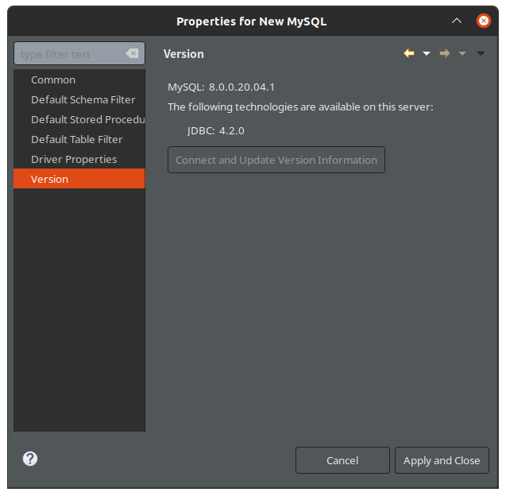
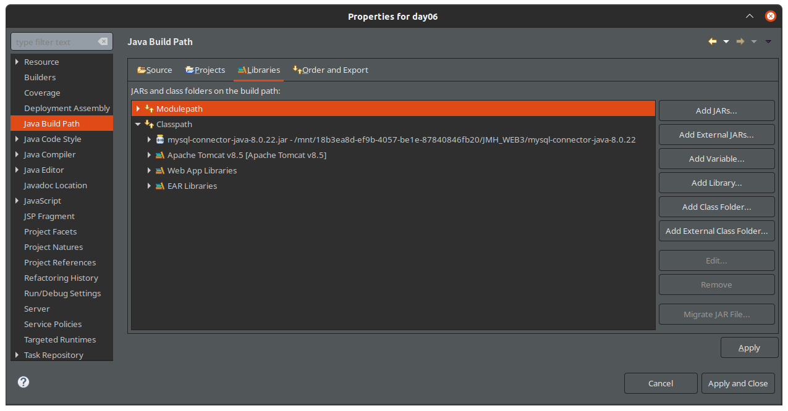
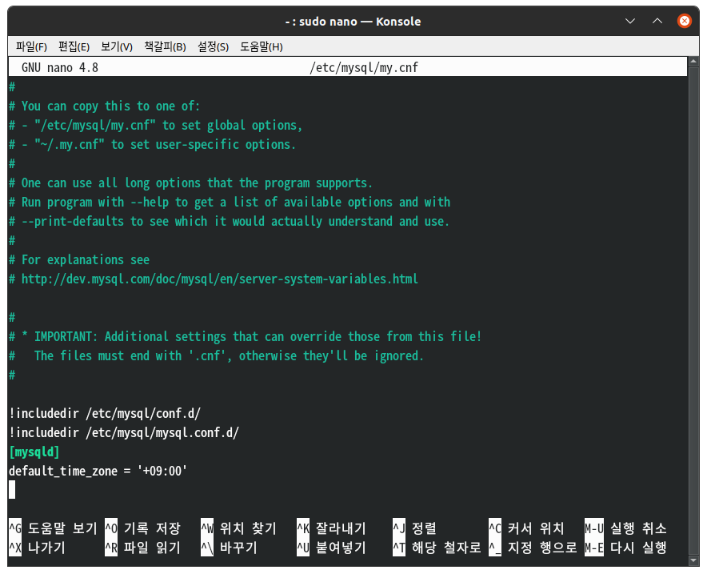

# MySQL 연결

oracle이 결국 안되서 그냥 MySQL로 진행하기로 하였음.. 

참고문서 \
[Ubuntu용 MySQL설치가이드](https://docs.rackspace.com/support/how-to/install-mysql-server-on-the-ubuntu-operating-system/)\
[MySQL설치 세팅 후 유저생성 및 DB생성법](https://dejavuqa.tistory.com/317)\
[Eclipse+MySQL연동법](https://pingfanzhilu.tistory.com/entry/JSP-Database-%EC%9D%B4%ED%81%B4%EB%A6%BD%EC%8A%A4-%EC%97%B0%EA%B2%B0)

# MySQL 세팅 

```java
String driver="com.mysql.cj.jdbc.Driver";
String url="jdbc:mysql://localhost:3306/mhj";
String user="mhj";
String password="0000";
```





# 오류발생&해결 

MySQL Connector 8이 호환성이 좋아 연결하였는데, 이는 Timezone 에러가 발생함. 따라서 아래와 같이 수정

`mhj@mhj-IdeaPad:~$ sudo nano /etc/mysql/my.cnf` 로 들어간 뒤 아래와 같이 수정


