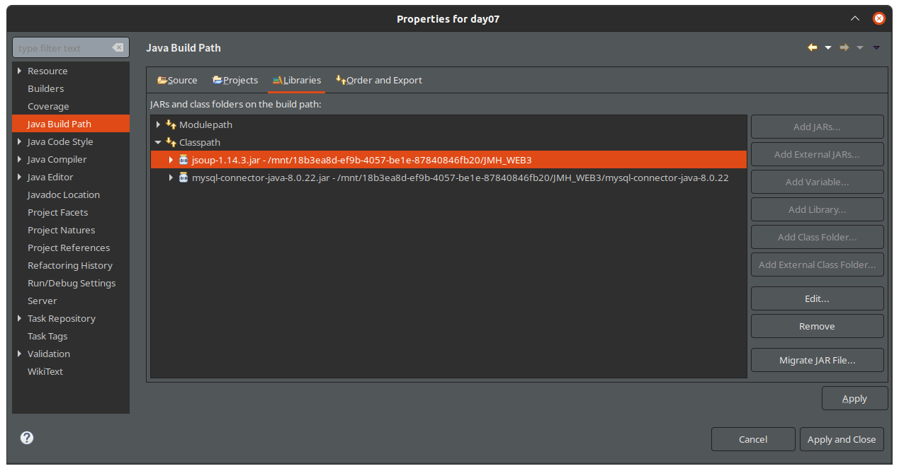
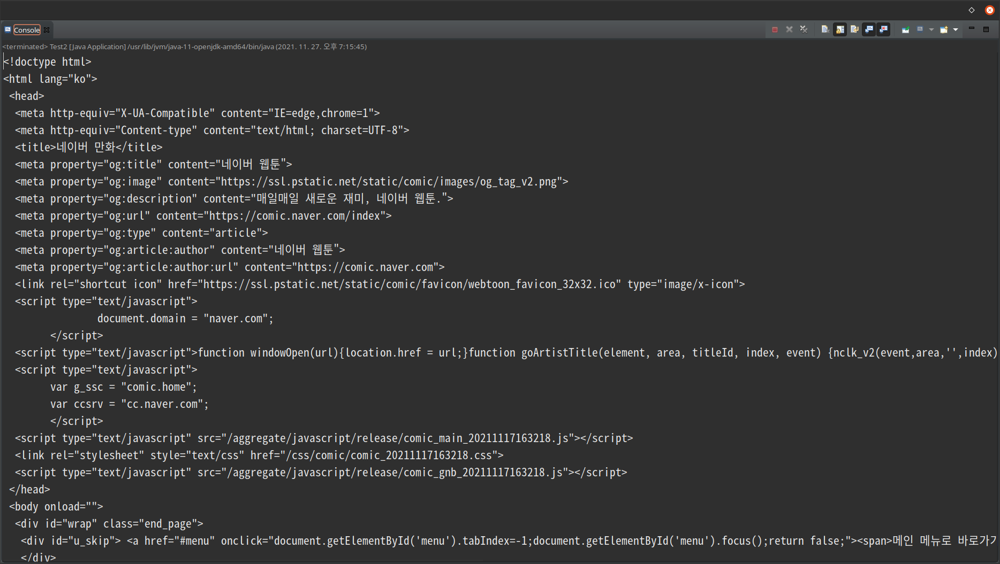
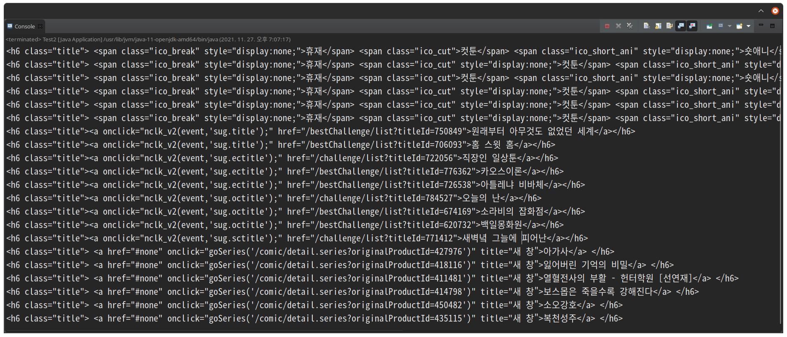
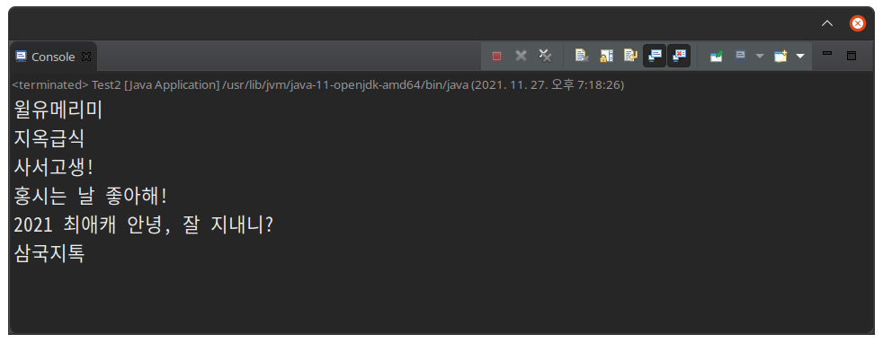

# What is Crawling? 

Crawling 이란, 사전적으로 기어다니는 동작을 의미하는데, 웹 프로그래밍적 의미로는 WEB 상에 존재하는 CONTENTS를 수집하는 작업이다. 

일반적으로 크롤링은 HTML 페이지를 가져와서, HTML 혹은 CSS 부분을 [PARSING](https://na27.tistory.com/230) 하고,  필요한 데이터만 추출하는 기법이다. 

크롤링을 위해서는 웹의 데이터를 긁어오는 도구, 즉 라이브러리가 필요한데, Python의 경우 BeautifulSoup가 있고 selenium이라는 라이브러리도 있으며, 자바의 경우 Jsoup라는 HTML 파싱 라이브러리가 존재한다. 

그렇다면 어떻게 크롤링을 하는 것인지 직접 Jsoup을 통해 해보도록 하자. 

# Settings 

앞서 말했듯이, 크롤링에는 Jsoup 이라는 이름의 라이브러리가 필요하다. 따라서 그 라이브러리를 가져와서 인식시켜주어야 한다. 아래와 같이 (.jar)라이브러리를 인식시켜주자. 



# Crawling 

네이버 웹툰의 index 페이지를 가져와 보자. 

```java
public static void main(String[] args) {
		String url="https://comic.naver.com/index";
		// 크롤링대상 url지정
		
		try {
			Document doc=Jsoup.connect(url).get();
			System.out.println(doc);
            } catch (IOException e) {
			e.printStackTrace();
		}
``` 

이렇게 하면 아래와 같이 index 페이지의 모든 데이터, 즉 html을 포함한 모든 데이터를 가져온다. 즉, `doc` 이라고 하는 객체는 url 상의 모든 데이터를 갖고 있는 셈이다. 



이제 우리는 데이터를 '선별해서' 가져올 필요성을 느낄 수 있다. 데이터는 선별되지 않으면 아무런 의미가 없기 때문이다. 따라서, 데이터를 원하는 것만 추출하려면, 바로 저 객채 `doc` 에서 우리가 원하는 데이터의 위치를 알아야 데이터를 가져올 수 있다. 

우리는 네이버웹툰의 `장르별 추천웹툰` 에서 `만화 이름` 을 가져오려고 한다. 그 `만화 이름` 의 위치는 `h6.title` 이었으므로, 이 값들을 가져오도록 하려면 아래와 같이 하면 된다. 

```java
public static void main(String[] args) {
		String url="https://comic.naver.com/index";
		// 크롤링대상 url지정
		
		try {
			Document doc=Jsoup.connect(url).get();
			//System.out.println(doc);
			
			Elements ele=doc.select("h6.title");
			System.out.println(ele);
		
		} catch (IOException e) {
			e.printStackTrace();
		}

	}
``` 

바로 `doc.select(" ")` 을 사용하면 된다. `" "` 안에는 내가 추출하려는 데이터의 위치, 즉 태그를 입력하면 된다. 저 select 문의 리턴값은 `Elements` 타입이기 때문에, `Elements ele` 라는 객체를 만들어주고 `ele` 에 `h6.title` 에 해당하는 데이터들을 넣어준다. 이렇게 만들면 아래와 같은 결과가 나온다. 



그러면 이것들 중에서도 제목만 가져올 수는 없을까? 다음과 같이 `ele` 내부에서 `iterator();` 을 돌리면 된다. 

```java
	public static void main(String[] args) {
		String url="https://comic.naver.com/index";
		// 크롤링대상 url지정
		
		try {
			Document doc=Jsoup.connect(url).get();
			Elements ele=doc.select("h6.title");
				
			Iterator<Element> itr=ele.select("a > span").iterator();
			while(itr.hasNext()) {
				System.out.println(itr.next().text());
			}
		} catch (IOException e) {
			e.printStackTrace();
		}

	}
```

저렇게 iterator 을 사용하면, `ele.select(tag)` 부분에 해당하는 모든 정보를 `itr.hasNext()` 가 false 일 때 까지 가져온다. 그래서 저 코드를 실행시키면 아래와 같이 우리가 원했던 정보만 가져올 수 있다. 


