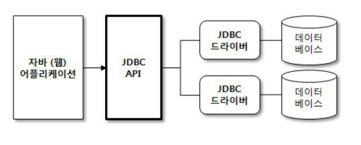
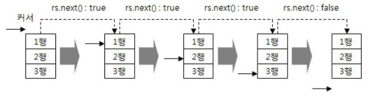

# JDBC 

**JDBC => JAVA DATABASE CONNECTIVITY**
- 자바에서 DB 프로그래밍을 하기 위해 사용되는 API이다. 
- 데이터베이스 종류에 상관없다

## JDBC API 사용 어플리케이션의 기본 구성


여기서 JDBC드라이버란 각 DBMS에 알맞는 클라이언트를 의미한다. 

## JDBC 프로그래밍 코딩 흐름

### 1. JDBC 드라이버 로드 
```java
String driver="com.mysql.cj.jdbc.Driver";
Class.forName(driver);
```
DBMS별로 알맞은 JDBC 드라이버(.jar)가 필요함

### 2. DB 연결

일반적인 DB 연결 코드 

```java
String url="jdbc:mysql://localhost:3306/mhj";
String user="mhj";
String password="0000";

Connection conn = null;

try {
	conn = DriverManager.getConnection(url, user, password);
    ...
	} catch (Exception e) {
		e.printStackTrace();
	} finally {
		try {
			if(conn!=null) {
				conn.close();
			}
		} catch (SQLException e) {
			e.printStackTrace();
		}
	}
```

- `conn = DriverManager.getConnection(url, user, password);` 이 부분이 제일 핵심 코드. DriverManager 을 이용해 Connection을 생성한다. 
- `if(conn!=null) {conn.close();}` 도 중요한 부분. conn이 null인데 `conn.close();` 를 하게 되면 NullException이 발생한다. 따라서 if문으로 예외 발생조건을 사전에 차단시킨다. 

### 3. PreparedStatement를 이용한 쿼리 실행

그냥 Statement를 사용해도 무방하지만, PreparedStatement가 사용에 조금 더 편리함이 있다.

```java
String sql="select uname,content from test";
PreparedStatement pstmt=null;

try {			
	...
	pstmt = conn.prepareStatement(sql);
	ResultSet rs = pstmt.executeQuery();
	
	rs.close();
} catch (Exception e) {
	e.printStackTrace();
} finally {
	try {
		if(pstmt!=null) { 
			pstmt.close();
		}
	} catch (SQLException e) {
		e.printStackTrace();
	}
}
```

- `pstmt = conn.prepareStatement(sql);` 혹은 `pstmt = (PreparedStatement) conn.createStatement();` 로 prepareStatement를 생성한다. 
    + `prepareStatement(sql);` 은 SQL문을 미리 컴파일 함으로써 실행 속도를 높일 수 있다. 
- prepareStatement가 제공하는 메서드를 통해 prepare된 쿼리를 실행한다.

|SELECT|INSERT, UPDATE, DELETE|
|-|-|
|`ResultSet rs = pstmt.executeQuery(sql);`|`int cnt = stmt.executeUpdate(sql);`|
- ResultSet로 가져온 값을 조회하는 로직

	```java
	while(rs.next()){
			out.println(rs.getString(name));
				...
		}
	```
