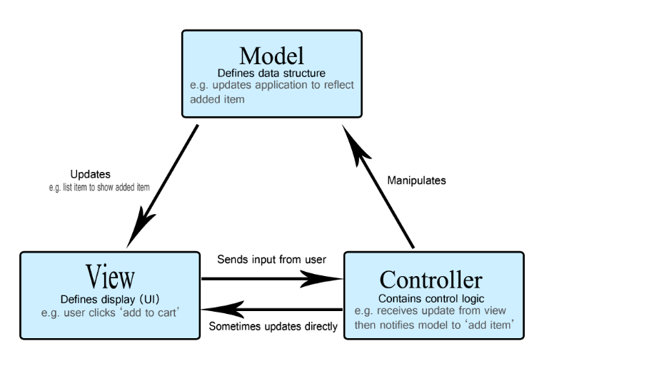
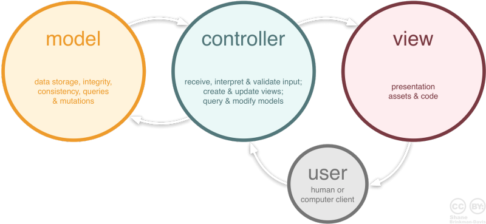

# WHAT IS MVC? 

MVC-(MODEL, VIEW, CONTROLLER) 는 사용자 인터페이스, 데이터 및 논리 제어를 구현하는데 널리 사용되는 소프트웨어 디자인 패턴이다. 소프트웨어의 로직과 화면을 구분하는데 중점을 두고 있으며, 이러한 분리는 곧 더 나은 업무의 분리를 통해 더 편한 유지보수가 가능해진다. MVC의 모습은 다음과 같다. 

***

위 그림의 순서는 다음과 같다 : 
1. 사용자가 view를 통해 controller를 조작한다.
2. controller는 model을 통해서 데이터를 받아온다.
3. controller이 받은 데이터 값을 view에게 전달한다. 
4. view는 전달받은 값을 사용자에게 보여준다. 

## MODEL 

모델은 데이터와 비즈니스 로직을 관리한다. DB와 연동해 사용자가 원하는 기능을 제공하는 로직을 담고 있다. 구체적으로 말하자면, 웹에 존재하는 **모든 데이터**들을 정의하는 곳이다. 

모델에는 다음과 같은 규칙이 존재한다. 

### 1. 사용자가 편집하기 원하는 데이터는 모두 가지고 있어야 한다. 

즉, 데이터의 정보에 대해 알고 있어야 한다. 그래서 MODEL 에는 데이터의 정보를 구현하는 **VO** 가 있다. VO(Value Object)는 DB를 구성하는 데이터 이름을 변수로 갖고, 그 변수에 접근할 수 있는 getter, setter 메소드 조합으로 클래스가 이루어져 있다. 

프로그램의 사용자가 화면에서 어떤 데이터를 입력하거나 조회 요청이 왔을 때, 입력된 데이터나 조회하는 조건을 VO에 담아서 DAO에 요청하면 DAO는 저장소(일반적으로 Database)로부터 데이터를 입력하거나 조회한 후 그 결과를 돌려주게 된다.

DAO란 Data Access Object의 약자로 데이터베이스에 접근해 데이터에 대한 CRUD를 수행한다. DAO는 데이터베이스의 세부 내용을 노출하지 않고 단독적으로 DB를 관리하는 기능을 수행하며 **단일 책임 원칙(Single Responsibilty Principle)** 을 지켜야 한다. 

MVC에서는 Controller가 요청받은 기능을 반드시 DAO를 거쳐서 작업하며, DAO는 요청받은 기능에 대해 수신할 수 있어야 하고 수신받은 기능에 대해 작업한 결과를 Controller에게 리턴해 준다.

### 2. 뷰나 컨트롤러에 대해서 어떤 정보도 알지 말아야 한다.

MODEL에서 직접적으로 무언가를 주도적으로 변경할 수 있게 하지 않는다. 그렇기 때문에 MODEL 내부 클래스들은 모두 데이터를 정의하고 전달하는 역할만 해야 하고, 직접 데이터에 값을 넣거나 변경하지 않는다. 

### 3. 변경이 일어나면, 변경 통지에 대한 처리방법을 구현해야만 한다. 

> 모델의 속성 중 텍스트 정보가 변경되면, 이벤트를 발생시켜 누군가에게 전달해야 하며, 누군가 모델을 변경하도록 요청하는 이벤트를 보냈을때 이를 수신할 수 있는 처리 방법을 구현해야 한다. 이는 모델이 변경되는 방법을 다른 구성 요소들에게 알려주게 되는 방법이다.

***

## VIEW 

일반적으로 사용자의 인터페이스 부분을 의미한다. 사용자가 원하는 데이터 정보의 입출력을 담당한다. VIEW에서는 다음과 같은 규칙들이 있다. 

### 1. 모델이 가지고 있는 정보를 따로 저장해서는 안된다.

CONTROLLER가 요청한 정보를 MODEL로부터 가져오고, 리턴받은 정보를 CONTROLLER가 받아서 VIEW를 통해 사용자에게 보여주게 될텐데, 그 정보를 유지하기 위해 VIEW 내부에 데이터 값을 저장해서는 안된다. VIEW는 데이터를 받아 표시하는 기능만 할 뿐, 데이터를 표시하고 난 뒤에는 전부 잊어먹은 상태이여야 한다. 

### 2. 모델이나 컨트롤러와 같이 다른 구성요소들을 몰라야 된다.

MODEL과 마찬가지로 VIEW 역시 자기 자신만 알고 있어야 하며 다른 요소들이 어떻게 동작되는지에 대해 알고 있어서는 안된다. 

### 3. 변경이 일어나면 변경통지에 대한 처리방법을 구현해야만 한다. 

역시 MODEL과 마찬가지로 사용자가 요청한 변경사항에 대해 CONTROLLER에게 알릴 수 있어야 하며 CONTROLLER는 그에 대한 동작을 수행해야 할 것이다. 

***

## CONTROLLER 

MODEL과 VIEW를 잇는 다리 역할을 한다. 사용자가 일으키는 모든 '이벤트' 에 대해 처리하는 역할을 맡고 있다. CONTROLLER의 규칙은 다음과 같다. 

### 1. 모델이나 뷰에 대해서 알고 있어야 한다.

MODEL과 VIEW는 자기 자신을 제외하고는 서로의 존재를 모르는 상태이므로, 이를 중재하기 위해 CONTROLLER는 MODEL과 VIEW에 대해 알고 있어야 한다. 

### 2. 모델이나 뷰의 변경을 모니터링 해야 한다.

VIEW 혹은 MODEL에서 일어난 이벤트에 대해 수신하고 그에 따른 기능을 수행할 수 있도록 명령하는 역할을 한다. 

***

## WHY WE USE MVC? 

그래서 이렇게 복잡해 보이는 MVC를 배우는 이유는 무엇일까? 하나의 소프트웨어에는 여러가지 기능들이 존재하는데, 이 기능을 한가지 클래스에서 전부 다루려면 다룰 수는 있지만... 유지보수나 변경사항에 매우 취약한 상태가 되므로 좋은 코드가 아닐 것이다. 따라서 소프트웨어의 동작을 크게 세가지로 분리하여 각자의 역할에만 집중하게 하여 유지보수성, 확장성, 유연성을 늘릴 수 있는 코드를 만들 수 있는 것이다. 