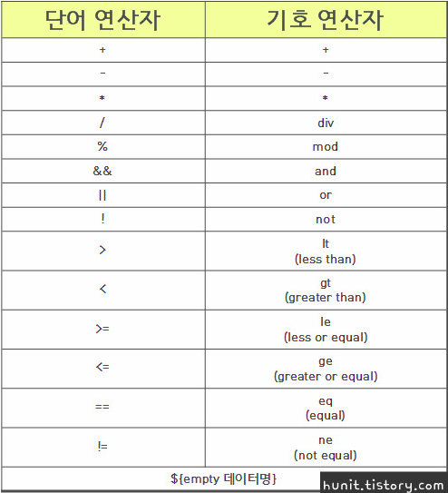
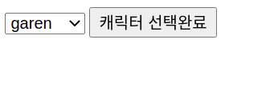
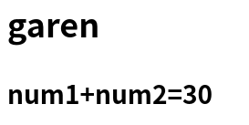

# Make the view like a 'view'

지금까지 우리는 View 화면에 스크립트릿 등을 사용하여 객체를 만들거나 동작을 수행하였다. 예를 들어 `useBean` 과 `<% %>`, `<%= %>` 를 만들어 사용했던 것처럼 말이다. 

```jsp
<% Test test = new Test(); %>
```
우리는 이와 같은 자바 코드를 대체하기 위해 아래처럼 `jsp action` 중 하나인 `useBean` 을 사용했고,
```jsp
<jsp: useBean id="test" class="test.jsp"/>
```
이 `useBean` 을 사용해 만든 객체 `test` 를 사용하기 위해 아래처럼 표현식을 사용했다. 
```jsp
<%= test.getNum() %>
```
하지만 이것은 사용하기 불편하고 코드 역시 길어질 뿐만 아니라, 결국에 자바코드를 jsp에 넣은 것이므로 이는 View에서 작업하는 퍼블리셔 혹은 웹디자이너와의 협력에서 그들의 코드 이해 속도를 떨어뜨리는 주요 원인이 될 수도 있다. 그렇기 때문에 View 는 View를 보는 주요한 사람이 이해하기 쉽도록 하기 위해 특별한 기술이 필요해진다. 그 기술에 대해 배워보도록 하자. 

## EL

EL 은 Expression Language 의 줄임말으로, 말 그대로 표현을 위한 언어이다. 이는 `<%= %>`, `out.println();` 과 같은 자바코드를 더 이상 사용하지 않고 좀 더 간편하게 출력을 지원하기 위한 도구이다. 자체적으로 아래와 같은  연산식을 지원한다. 



대표적인 EL문은 아래와 같이 사용한다. 

```jsp
${test.num} 
${test["num"]}
``` 
두 식 모두 같은 의미이다. 

만약 paramValues 를 사용하고 싶다면, 아래와 같이 사용한다. 

```jsp
${test.num[0]} 
${test["num"][1]}
```
차이점이라면 `.` 을 사용하는 경우 인덱스 0부터 시작하고 `[]` 을 사용하는 경우 인덱스 1부터 시작한다는 점이 있으나, 근본적으로 똑같은 의미를 갖는다. 

### Application

Selection 이라는 클래스를 만들어 기본 데이터를 저장해 놓자. 
```java
public class Selection {

	private String[] nameList= {"timo","ari","amumu","garen"};
	private int num1=10;
	private int num2=20;
	
	public String[] getNameList() {
		return nameList;
	}
	public int getNum1() {
		return num1;
	}
	public int getNum2() {
		return num2;
	}
}
```
그리고 이 데이터들을 받을 jsp 파일 하나를 만들어보자. 
```jsp
<jsp:useBean id="nl" class="day12.Selection" scope="session"/>
<form action="showResult.jsp" method="post">
    <select name="cname">
        <%
            for(String v:nl.getNameList()){
                out.println("<option>"+v+"</option>");
            }
        %>
    </select>
    <input type="submit" value="선택완료">
</form>
```
이제 showResult.jsp 파일을 만들어보자. 

```jsp
<h2><%=request.getParameter("cname")%><h2>
```
원래같으면 이렇게 표현식을 이용해 출력했겠지만 이제 우리는 다음과 같이 EL문을 사용할 수 있다. 
```jsp
<h2>${param.cname}<h2>
```
`param.~`을 사용하는 이유는 간단하다. 이 EL식이 어떤 자바코드를 대체하였는지 알면 된다. 우리가 `request.getParameter();` 을 사용하였기 때문에 파라미터값을 받는 것이므로 `param.~`을 사용하는 것이다. 

또한 Selection 클래스의 num1과 num2를 서로 연산해보는 코드를 아래와 같이 만들 수 있다. 
```jsp
<h3>num1+num2=${nl.num1+nl.num2}</h3>
```
그렇게 완성된 showResult.jsp 는 다음과 같다.
```jsp
<h2>${param.cname}</h2>
<h3>num1+num2=${nl.num1+nl.num2}</h3>
```

이들을 실행하면 다음과 같은 결과가 나오게 된다. 




## CustomTag