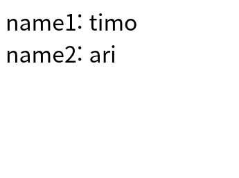
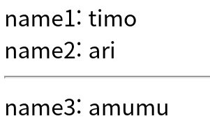
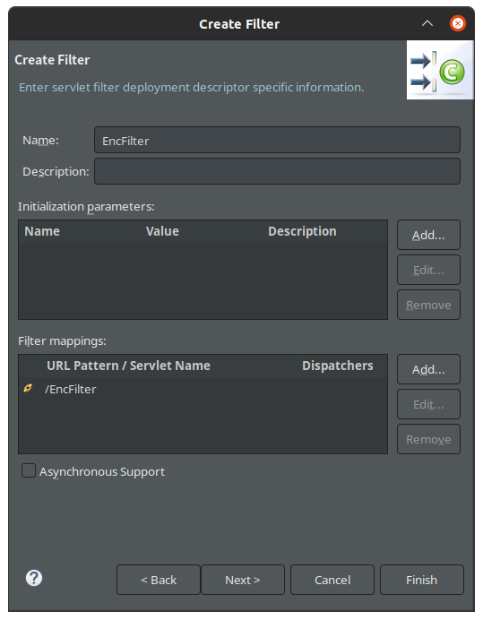
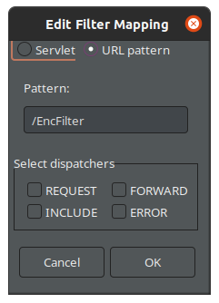
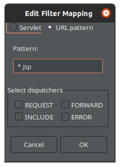
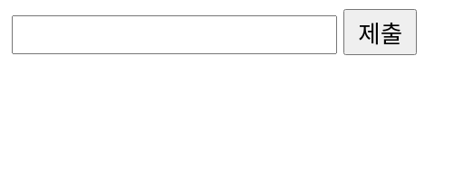

# Init Parameter

- 웹 어플리케이션이 처음으로 실행되면 정보들이 로딩되는데, 이것을 세팅하는데 사용한다. 
- 웹 어플리케이션의 전반적인 흐름에서 공통적으로 사용되는 값을 설정하는 용도로 사용된다. 
- 초기화 매개 변수는 서블릿 프로그램이 처음 실행될 때 클라이언트가 아닌 서버로부터 넘겨받는 값이다.

- 예를 들자면, 아래와 같이 DB에 접속할 수 있는 주소값이 초기화 매개변수이다. 
```java
String driver="com.mysql.cj.jdbc.Driver";
String url="jdbc:mysql://localhost:3306/mhj";
String user="mhj";
String password="0000";
```
- 웹 프로그램은 모든 실행 시작점이 웹 서버의 구동이다. 이때 web.xml 파일이 자동으로 로드된다.
- 여기에 초기화 매개변수를 등록해서 웹 페이지가 매개변수의 값을 읽어들인다.
- 이렇게 해서 서블릿을 재컴파일하지 않고서도 원하는 초기값을 웹 페이지에 전달할 수 있다.
- 외부에 공통값을 설정해주어서 내부 어플리케이션에서 그 값을 참조하여 사용하도록 한다. 그 이유는 내부에 공통값을 설정해놓으면 실수로 변경될 수 있기 때문이다. 
- 외부에 공통값을 설정한다는 의미는, 별도의 환경설정 파일을 생성하여 관리한다는 의미이다. 예를들어 .xml 파일을 통해 공통값을 관리할 수 있다. 

***

일반적으로, 프로그램을 배포할 때 기본정보들을 소스코드에 하드코딩하지 않는다. 

그렇다면 초기화 매개변수를 어떻게 사용하는지 알아보자. 예제를 위해 서블릿 파일을 만들고, 데이터를 전달할 것이므로, post를 사용하기 위해 테스트 코드를 `doPost()` 에 넣었다. 

```java
protected void doGet(HttpServletRequest request, HttpServletResponse response) throws ServletException, IOException {
		doPost(request, response);
	}

protected void doPost(HttpServletRequest request, HttpServletResponse response) throws ServletException, IOException {
		
		PrintWriter out = response.getWriter();
		out.println("<html><body>name1:___ <br> name2:___  </body></html>");		
	}
```

xml파일을 해놓으면 관리하기는 좋으나, java 코드분석 시 xml파일을 찾으러 가야 하기 때문에 불편함이 생긴다. 그렇기 때문에 아래와 같이 서블릿 파일에서 바로 기본값을 세팅할 수 있다. 

```java
@WebServlet(urlPatterns= {"/TestServlet"}, initParams= {
		@WebInitParam(name="name1", value="timo"),
		@WebInitParam(name="name2", value="7days")
})
```

만약 저 정보를 xml파일에서는 어떻게 세팅하는지 궁금하다면, 다음과 같이 하면 된다. 

```xml
<servlet>
       <servlet-class>day15.TestServlet</servlet-class>
       <servlet-name>testServlet</servlet-name>
       <init-param>
          <param-name>name1</param-name>
          <param-value>timo</param-value>
       </init-param>
       <init-param>
          <param-name>name2</param-name>
          <param-value>ari</param-value>
       </init-param>
    </servlet>
    <servlet-mapping>
        <servlet-name>testServlet</servlet-name>
        <url-pattern>/TestServlet</url-pattern>
    </servlet-mapping>
```

참고로, xml 파일과 `@~~` 을 동시에 사용할 수 없기 때문에 둘 중 하나만 사용하여야 한다. 

***

그렇다면, 저 테스트 코드의 빈칸을 채워주자. 초기화 매개변수를 설정해주었으니, 저 값을 어떻게 가져오기 위해서는 다음과 같이 하면 된다. 

```java
@WebServlet(urlPatterns= {"/TestServlet"},initParams= {
	@WebInitParam(name="name1",value="timo"),
	@WebInitParam(name="name2",value="ari")
})

...

protected void doPost(HttpServletRequest request, HttpServletResponse response) throws ServletException, IOException {
      PrintWriter out=response.getWriter();
      out.println("<html><body>name1: "+getInitParameter("name1")+" <br> name2: "+getInitParameter("name2")+" </body></html>");
   }
```
이렇게 `getInitParameter("ParameteName")` 를 해주면 파라미터 값에 설정된 값을 가져올 수 있다. 


***
그렇다면, `@` Annotation 을 이용하지 않고 xml 파일을 이용해 세팅하려면 어떻게 해야 할까? 예제를 위해 적절한 xml 파일과 jsp 파일을 만들자.
```xml
<?xml version="1.0" encoding="UTF-8"?>
<web-app xmlns:xsi="http://www.w3.org/2001/XMLSchema-instance" xmlns="http://java.sun.com/xml/ns/javaee" xmlns:web="http://java.sun.com/xml/ns/javaee/web-app_2_5.xsd" xsi:schemaLocation="http://java.sun.com/xml/ns/javaee http://java.sun.com/xml/ns/javaee/web-app_3_0.xsd" id="WebApp_ID" version="3.0">
   <context-param>
      <param-name>name3</param-name>
      <param-value>amumu</param-value>
   </context-param>
</web-app>
```

```jsp
<%@ page language="java" contentType="text/html; charset=UTF-8"
    pageEncoding="UTF-8"%>
<!DOCTYPE html>
<html>
<head>
<meta charset="UTF-8">
<title>Insert title here</title>
</head>
<body>
name3: <%= getServletContext().getInitParameter("name3") %>
</body>
</html>
```

이 jsp 파일을 실행시키면 아래와 같은 결과가 나온다. \
\

***

그렇다면, `@` Annotation과 xml을 동시에 사용하면 어떻게 될까? Servlet파일의 코드를 살짝 바꿔주자. 
```java
protected void doPost(HttpServletRequest request, HttpServletResponse response) throws ServletException, IOException {
	   PrintWriter out=response.getWriter();
	   out.println("<html><body>name1: "+getInitParameter("name1")+" <br> name2: "+getInitParameter("name2")+" <hr> name3: "+getServletContext().getInitParameter("name3")+" </body></html>");
   }
```
\


# Listner 

- 초기화 매개변수가 자잘한 String타입 데이터를 보관한다면, Listener는 자바객체를 공유하기 위한 수단이다. 
- 컨테이너가 수행하는 이벤트를 모니터링 하다가 특정 상황에서 액션을 수행하는 특수한 형태의 서블릿
- 톰캣 == 서버 == 서블릿 컨테이너 
- 웹을 시작하기 전에 web.xml이 있다면 그것을 먼저 읽은 뒤, Listner을 읽고, .jsp파일(.Servlet.java)을 실행한다. 

리스너 파일은 어떻게 만들까? 리스너는 객체를 공유하는 것이므로, 먼저 객체를 만들 클래스가 필요하다. 

```java
package day15;

public class Product {
	private String name;
	private int price;
	public Product(String name, int price) {
		this.name = name;
		this.price = price;
	}
	public String getName() {
		return name;
	}
	public void setName(String name) {
		this.name = name;
	}
	public int getPrice() {
		return price;
	}
	public void setPrice(int price) {
		this.price = price;
	}
	
}
```

```java
package day15;

import javax.servlet.ServletContext;
import javax.servlet.ServletContextEvent;
import javax.servlet.ServletContextListener;
import javax.servlet.annotation.WebListener;

/**
 * Application Lifecycle Listener implementation class TestListner
 *
 */
@WebListener
public class TestListner implements ServletContextListener {

    /**
     * Default constructor. 
     */
    public TestListner() {
        
    }

	/**
     * @see ServletContextListener#contextDestroyed(ServletContextEvent)
     */
    public void contextDestroyed(ServletContextEvent arg0)  { 
         
    }

	/**
     * @see ServletContextListener#contextInitialized(ServletContextEvent)
     */
    public void contextInitialized(ServletContextEvent arg0)  { 
         ServletContext sc = arg0.getServletContext();
         Product p = new Product("제품", 20000);
         sc.setAttribute("p", p);
         System.out.println("log: serverstat");
    }
	
}
```

이렇게 만든 Product 클래스를 리스너의 `public void contextInitialized(ServletContextEvent arg0)` 함수에서 객체를 선언해주면, 서버를 시작할 때 p 라는 객체를 만든다. 이 객체를 이용하는 jsp파일을 만들고 실행하였다. 

```jsp
<%@ page language="java" contentType="text/html; charset=UTF-8"
    pageEncoding="UTF-8"%>
<!DOCTYPE html>
<html>
<head>
<meta charset="UTF-8">
<title>Insert title here</title>
</head>
<body>

<h3>리스너로 등록한 자바객체 내용을 확인해보자</h3>

상품명: ${p.name }<br>
가격: ${p.price }원

</body>
</html>
```

\

# Filter

말 그대로 필터역할을 하는 파일이다. 어떠한 특정 파일을 실행하기 전에, 먼저 실행되어 인코딩 같은 설정들을 미리 바꿔주는 역할을 한다. 

필터를 만들면 이런 창이 뜨게 된다. \
\
여기서 **Filter mappings**는 Filter의 핵심 부분인데, 바로 **어떤 파일**을 실행하기 전에 이 필터를 작동시킬 것인지 설정하는 부분이다. 이 부분을 자세히 보면 아래와 같은 창이 나온다.\
\
여기서 `/EncFilter` 라고 되어 있는 부분을 아래와 같이 바꾸면, .jsp로 끝나는 모든 파일에 대해 이 필터가 작동할 것이다. \
\

이렇게 필터 파일을 만든 뒤, 이 필터를 실습하기 위한 html, jsp파일을 만들어보자. 

```java
package day15;

import java.io.IOException;
import javax.servlet.Filter;
import javax.servlet.FilterChain;
import javax.servlet.FilterConfig;
import javax.servlet.ServletException;
import javax.servlet.ServletRequest;
import javax.servlet.ServletResponse;
import javax.servlet.annotation.WebFilter;

/**
 * Servlet Filter implementation class EncFilter
 */
@WebFilter("*.jsp")
public class EncFilter implements Filter {
	
	private String encoding;

    /**
     * Default constructor. 
     */
    public EncFilter() {
        
    }

	/**
	 * @see Filter#destroy()
	 */
	public void destroy() {
		
	}

	/**
	 * @see Filter#doFilter(ServletRequest, ServletResponse, FilterChain)
	 */
	public void doFilter(ServletRequest request, ServletResponse response, FilterChain chain) throws IOException, ServletException {
		
		// place your code here
		request.setCharacterEncoding(encoding);
		System.out.println("filter의 doFilter() 메서드 수행");
		// pass the request along the filter chain
		chain.doFilter(request, response);
	}

	/**
	 * @see Filter#init(FilterConfig)
	 */
	public void init(FilterConfig fConfig) throws ServletException {
		// init(): 필터 최초 생성 시 1회 동작하는 메서드 
		this.encoding=fConfig.getServletContext().getInitParameter("encoding");
		// 초기화 매개변수로 설정할것임! 
	}
}
```

```html
<!DOCTYPE html>
<html>
<head>
<meta charset="UTF-8">
<title>Insert title here</title>
</head>
<body>
	<form action="end.jsp" method="post">
		<input type="text" name="str">
		<input type="submit" name="필터실습">
	</form>
</body>
</html>
```

```jsp
<%@ page language="java" contentType="text/html; charset=UTF-8"
    pageEncoding="UTF-8"%>
<!DOCTYPE html>
<html>
<head>
<meta charset="UTF-8">
<title>Insert title here</title>
</head>
<body>
    str:${param.str}
</body>
</html>
```

이렇게 만든 파일을 실행시키면 아래와 같은 결과가 나온다.\


그리고 입력칸에 한글데이터를 넣고 submit을 해주면, console창에 아래와 같이 filter가 작동된 모습을 볼 수 있고, end.jsp에서 한글깨짐없이 정상적으로 출력되고 있는 모습을 볼 수 있다. \
\
