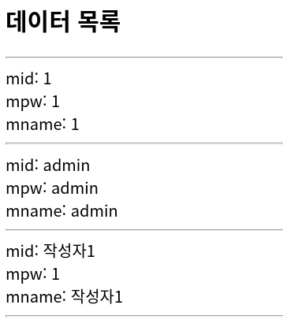

# DBCP & JNDI 

***
**DBCP = DataBase Connection Pool**
[DBCP Blog](https://zzang9ha.tistory.com/376)

**JNDI = Java Naming and Directory Interface**
[JNDI Blog](https://go-coding.tistory.com/76)
***

커넥션?
    어플리케이션-DB의 연결
    실무에서 관리해야하는 대상
    너무많은 동시접속자들은 서버에 부담을 줌 
    제때 접속자들의 커넥션을 처리하지 못하면 비용손실이 발생
그래서 서버에 부하를 줄이기 위해 DBCP를 사용한다. 

JDBC의 경우 아래 로직을 반복하는데, 

```
1. DB 접속을 위한 JDBC 드라이버 로드
2. getConnection Method로 부터 DB 커넥션 객체를 얻음
3. 쿼리 수행을 위한 PreparedStatement 객체 생성
4. excuteQuery를 실행해서 결과를 받아옴.
```

1,2번 로직은 매번 반복하므로 불필요할 수 있다. 이때, DBCP는 Connection을 Pool이라는 공간에 확보해 놓고, 미리 확보된 Connection을 가져다 사용한다. 

DBCP의 경우 아래와 같은 특징이 있다. DBCP에서 커넥션을 확보하기 위해 JNDI를 사용한다. 

```
1. 웹어플리케이션이 시작되면 서버에서 일정수의 커넥션을 생성한다. 
2. 어플리케이션에서 사용자요청에 따라 커넥션을 전달한다. => JNDI
3. 커넥션들을 반납, 최소 커넥션을 유지한다. 
```

만약 maxIdle 5개인데, 6번째 사용자 요청이 생기면 새로운 커넥션을 생성한다. 그러나 만약 사용자 수가 maxActive 보다 더 커지면 나중에 들어온 사용자는 일시적으로 Connection을 사용할 수 없게 된다. 

DBCP를 개발자가 만들면 유지보수나 서로 공유하기 힘들어지므로 인터페이스를 만들어 규칙을 강제하는 형태로 만든다. 네이밍 서비스의 한 종류로는 DNS가 있다. 톰캣 컨테이너는 DataSource 객체를 활용해 JNDI서비스를 제공한다. 

## 톰캣 DataSource설정

1. server.xml(톰캣 전반이 의존하는 설정파일) OR context.xml(어플리케이션과 관련된 설정파일) 중 하나를 변경하면 되나, server.xml은 잘못 건드릴 경우 복구가 힘들기 때문에 context.xml 을 선택하였음 

톰캣 `context.xml` 파일을 변경해보자.

```
maxActive : 동시에 사용할 수 있는 최대 커넥션 개수
maxIdle : Connection Pool에 반납할 때 최대로 유지될 수 있는 커넥션 개수
minIdle : 최소한으로 유지할 커넥션 개수
initialSize : 최소로 getConnection() Method를 통해 커넥션 풀에 채워 넣을 커넥션 개수
```
```xml
<Resource name="jdbc/mysql" auth="Container" type="javax.sql.DataSource" driverClassName="com.mysql.cj.jdbc.Driver" url="jdbc:mysql://localhost:3306/mhj" username="mhj" password="0000" maxActive="10" maxIdle="5">
    
</Resource>
```
***

2. 어플리케이션에서 설정한 JNDI서비스를 이용하기 위한 설정이 필요함 : web.xml 
 - context.xml에서 설정한 jdbc/mysql DataSource를 활용한 JNDI객체를 참조하겠다는 의미 
```xml
<?xml version="1.0" encoding="UTF-8"?>
<web-app xmlns:xsi="http://www.w3.org/2001/XMLSchema-instance" xmlns="http://java.sun.com/xml/ns/javaee" xmlns:web="http://java.sun.com/xml/ns/javaee/web-app_2_5.xsd" xsi:schemaLocation="http://java.sun.com/xml/ns/javaee http://java.sun.com/xml/ns/javaee/web-app_3_0.xsd" id="WebApp_ID" version="3.0">
   <resource-ref>
	<res-ref-name>jdbc/mysql</res-ref-name>
	<res-auth>Container</res-auth>
</resource-ref>
</web-app>
```
***
3. test 용 jsp 파일 생성 
```jsp
<%@ page language="java" contentType="text/html; charset=UTF-8"
    pageEncoding="UTF-8"%>
<%@ taglib uri="http://java.sun.com/jsp/jstl/sql" prefix="sql" %>
<%@ taglib uri="http://java.sun.com/jsp/jstl/core" prefix="c" %>
<!DOCTYPE html>
<html>
<head>
<meta charset="UTF-8">
<title>Insert title here</title>
</head>
<body>

<sql:query var="rs" dataSource="jdbc/mysql">
	select * from member;
</sql:query>

<h2>데이터 목록</h2>
<hr>
<c:forEach var="v" items="${ rs.rows}">
	mid: ${v.mid } <br>
	mpw: ${v.mpw } <br>
	mname: ${v.mname } <hr>
</c:forEach>

</body>
</html>
```


결과: JNDI 서비를 위한 이름을 등록하면 (jdbc/mysql) 그 이름을 통해 DataSource 객체 확보가 가능하고 그를 통해 연결하여 sql문을 실행할 수 있다. 

***

## Apply 

간단한 프로젝트를 만들어보자. 


