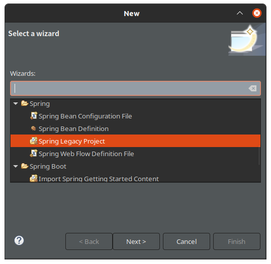
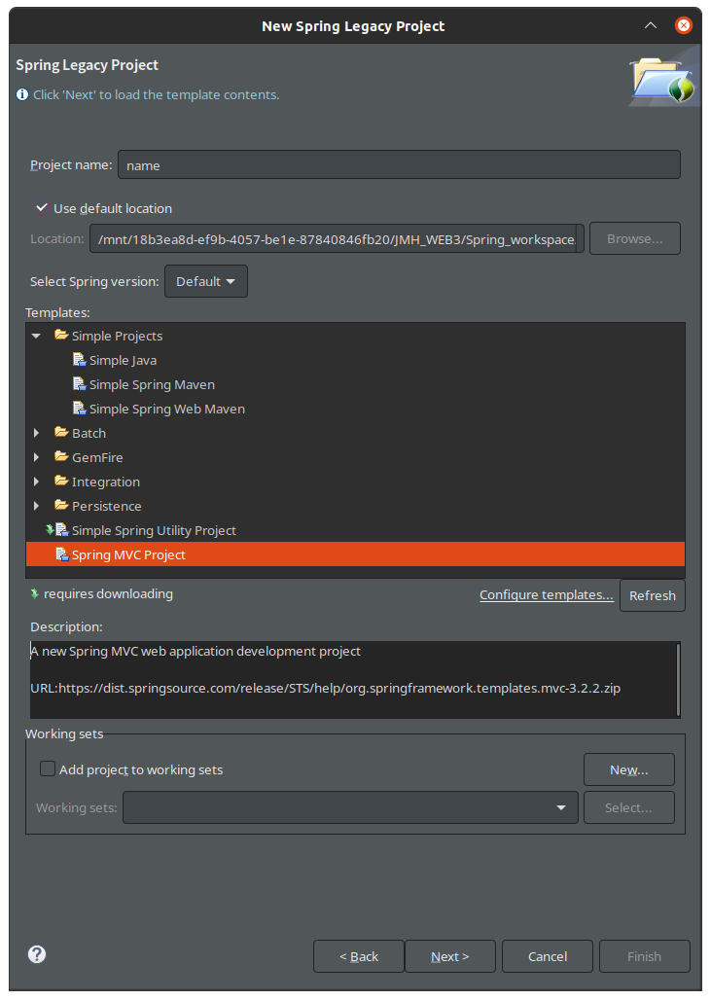
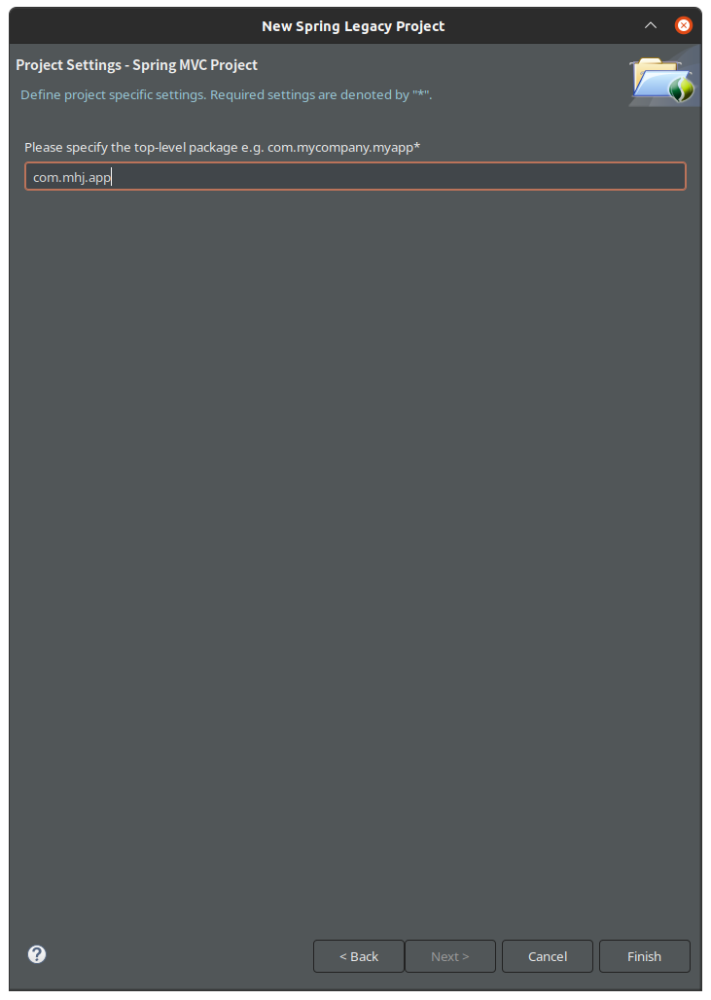
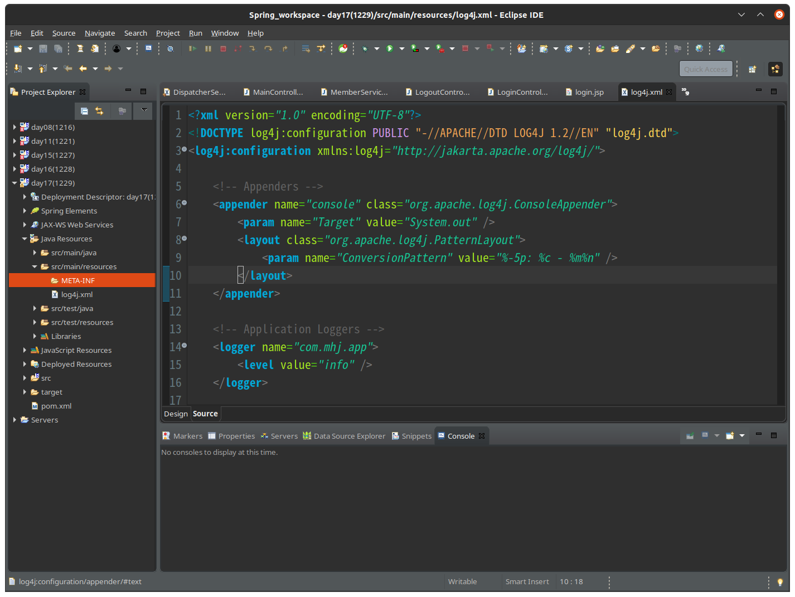
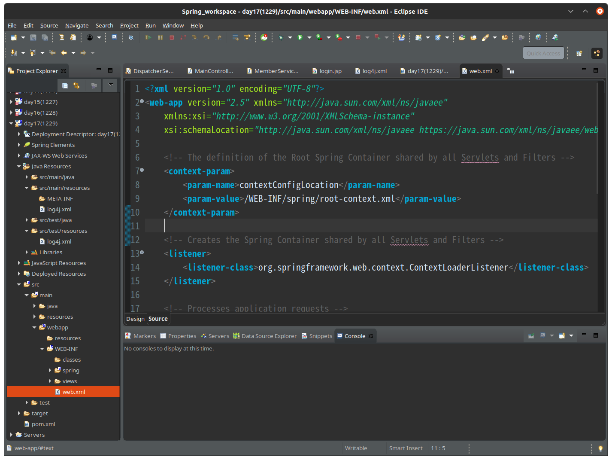
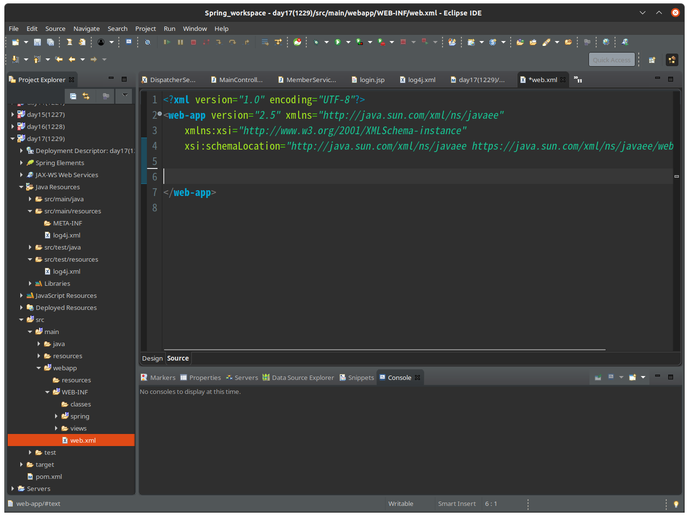
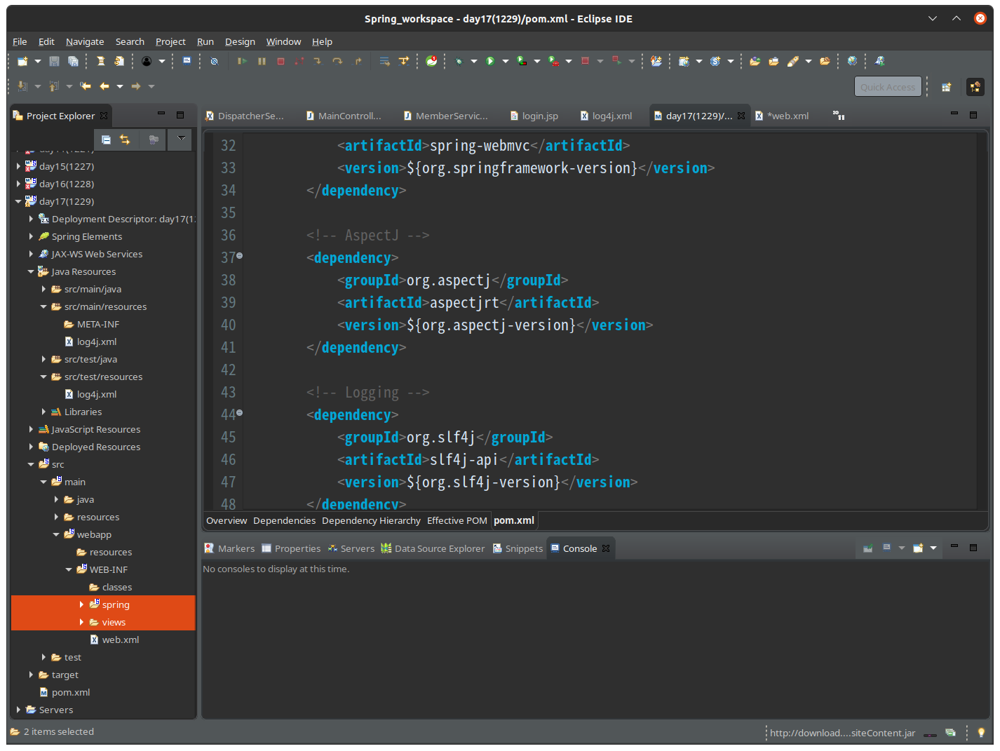
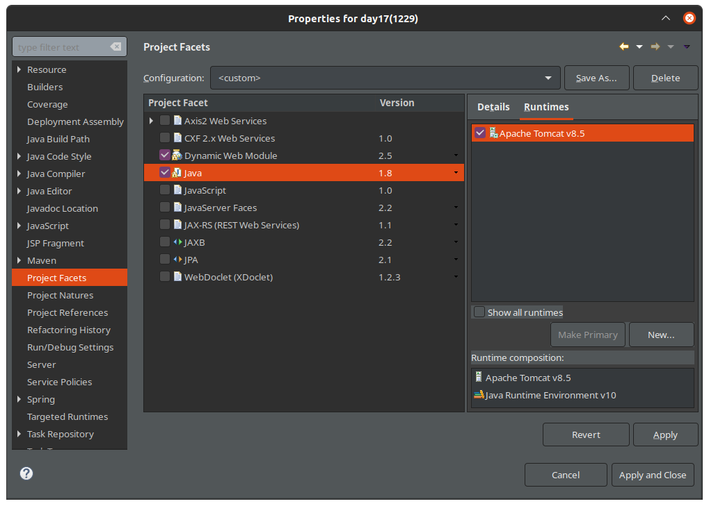
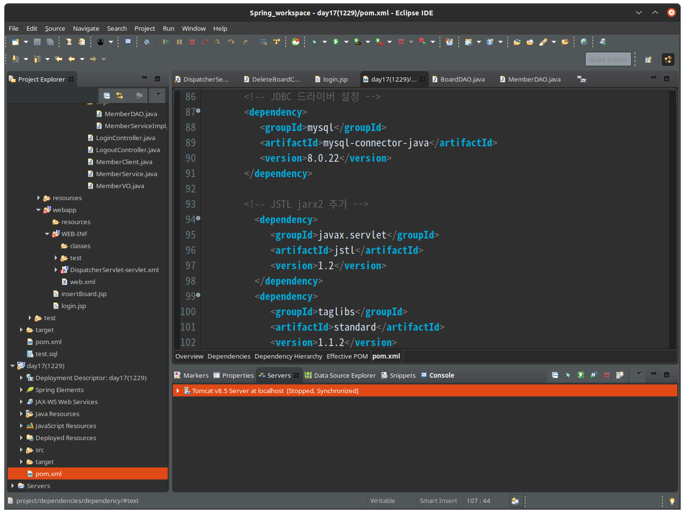

# Spring Setting

## Spring프로젝트 만들기  

1. Spring Legacy Project 선택

2. Spring MVC Project 선택 및 프로젝트 이름 작성

3. com.mhj.app 과 비슷하게 top-level package 선택

4. src/main/resources의 META-INF 삭제 (단순히 현재 쓰지 않는 폴더이기 때문에 정리해주는 것. 삭제하지 않아도 상관없음)

5. web.xml 정리 (이것 역시 현재 내가 사용하는 부분이 아니기 때문이다)

6. webapp 내부 사용하지 않는 파일 정리 

7. 현재 프로젝트의 Properties 의 Project Facets 설정

8. pom.xml 에서 jdbc driver, JSTL jar 등을 설정
