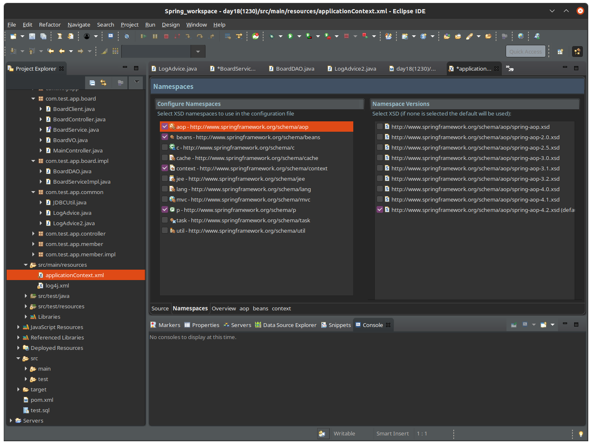

# AOP 

AOP 란?
- Aspect Oriented Programming (관점 지향 프로그래밍)

핵심관심: core concern => 비즈니스 메서드 CRUD
(트랜잭션, 로그, 예외처리) 횡단관심 crosscutting concern

☆유지보수
핵심관심 전후에 수행되는 횡단관심들의 유지보수 향상을 위해 AOP를 사용한다. 

## Before Using AOP

1. CRUD메서드 전에 로그를 적는 LogAdvice 클래스 생성
```java
package com.test.app.common;

public class LogAdvice {
    public void printLog() {
        System.out.println("비즈니스 로직 전에 출력하는 로그");
    }
}
```

2. BoardServiceImpl로 가서 CRUD메서드 수행 전에 로그 호출
```java
public void insertBoard(BoardVO vo) {		
		LogAdvice la = new LogAdvice();
		la.printLog();		
		boardDAO.insertBoard(vo);
	}

public void updateBoard(BoardVO vo) {
        LogAdvice la = new LogAdvice();
		la.printLog();
		boardDAO.updateBoard(vo);
	}

    ...
```
이런식으로 만들면 싱글톤 패턴이 깨지는데, new가 계속 생기기 때문이다. 
따라서 아래와 같이 변경한다. 

```java
private LogAdvice la;
	
public  BoardServiceImpl() {
    la = new LogAdvice();
}

@Override
public void insertBoard(BoardVO vo) {		
    // LogAdvice la = new LogAdvice();
    la.printLog();
    
    boardDAO.insertBoard(vo);
}
```

3. LogAdvice2.java 생성 후 코드변경

```java
package com.test.app.common;

public class LogAdvice2 {
	public void printLog2() {
		System.out.println("업그레이드 된 로그!");
	}
}
```
이렇게 만들고 LogAdvice2로 변환하면, Impl로 가서 코드하나하나를 또바꿔주어야 하기 때문에 너무 귀찮아진다... 그래서 AOP가 필요한 것이다.  

## AOP 사용 순서

1. AOP관련 pom.xml 설정

아래 코드를 pom.xml에 추가해준다. 
```xml
<!-- AspectJ -->
    <dependency>
        <groupId>org.aspectj</groupId>
        <artifactId>aspectjrt</artifactId>
        <version>${org.aspectj-version}</version>
    </dependency>	
    
    <dependency>
        <groupId>org.aspectj</groupId>
        <artifactId>aspectjweaver</artifactId>
        <version>${org.aspectj-version}</version>
    </dependency>
```

jar 파일이 제대로 들어왔는지 확인해준다. 


2. namespace추가 



3. .xml에 결합관련 설정 작성

    - la=new LogAdvice();을 위한 <bean>설정
    - 비즈니스메서드 호출시, la.printLog()호출될수있도록 설정

```xml
<bean id="la" class="com.test.app.common.LogAdvice" />
   <aop:config>
      <aop:pointcut expression="execution(* com.test.app..*Impl.*(..))" id="aPointcut"/>
      <aop:aspect ref="la">
         <aop:before pointcut-ref="aPointcut" method="printLog"/>
      </aop:aspect>
   </aop:config>
```
만약 LogAdvice2를 호출하고 싶다면..? 아래와 같이 xml 파일 일부만 바꿔주면 된다! bean의 `class=""` 을 바꾸고, class안에 있는 메서드명으로 `method=""` 을 바꿔주면 된다. 
```xml
<bean id="la" class="com.test.app.common.LogAdvice2" />
   <aop:config>
      <aop:pointcut expression="execution(* com.test.app..*Impl.*(..))" id="aPointcut"/>
      <aop:aspect ref="la">
         <aop:before pointcut-ref="bPointcut" method="printLog2"/>
      </aop:aspect>
   </aop:config>
```

## AOP Keywords

1. joinpoint
    + 포인트컷 후보(모든 비즈니스 메서드가 후보임)
    + 횡단관심에게 선택된 메서드를 포인트컷이라고 한다. 

2. pointcut == (비즈니스 메서드, CRUD)
    + expression + id 

+ pointcut 분류
보통 크게 두개로 분류한다. 
    - CUD : 보안, 
    - R : 로깅정도만..
|Create, Update, Delete|Read|
|-|-|
|`<aop:pointcut expression="execution(* com.test.app..*Impl.*(..))" id="aPointcut"/>`|`<aop:pointcut expression="execution(* com.test.app..*Impl.select*(..))" id="bPointcut"/>`|

3. advice == 횡단관심

AOP를 지원하는 컨테이너에 의해 결합될 수 있으므로 별도의 클래스로 지정된다. 

4. aspect 
pointcut과 횡단관심의 결합된 형태

즉, 조인포인트들 중에서 선택된 포인트들을 포인트 컷이라고 하고, 그 포인트컷들을 활용하는 것이 aspect이다. 
